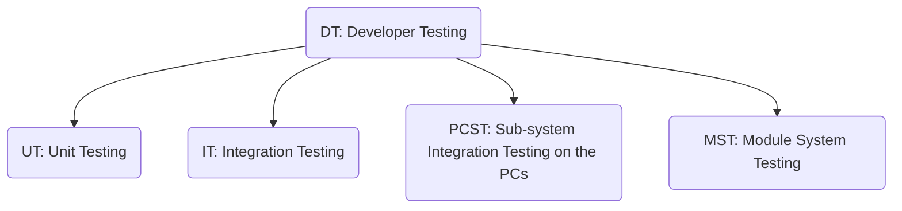

-   **华为需求分层描述框架**

**RR**（Raw Requirement，原始需求），来自公司内、外部客户的、解决方案伙伴的、关于公司产品与解决方案的、以客户视角描述的原始问题或者原始诉求。客户需求属于原始需求的一种类别。此类需求需要需求管理/分析团队（RMT/RAT）分析评审后作出决定。
原始需求细分为两类场景：１）销售项目需求：在市场销售项目售前、售后各阶段（对应LTC流程ML/MO/MCE阶段）产生的，并与项目的销售和交付直接相关的需求；2）非销售项目需求：泛指拜访客户、市场交流研讨活动，以及与解决方案伙伴合作过程中所得，与具体的销售项目无直接关联的需求，以及华为交付实体间提出的内部需求（如：解决方案对部件产品、产品对产品、产品对平台提出的需求）。

**PB**（Problem，客户问题），客户面对的挑战与机会（客户战略与痛点），也就是该版本为客户解决的核心问题。通过解决核心问题为客户带来的核心价值。

**SF**（System Feature，系统特性），版本为支撑“客户问题（PB）”所具备的重大能力。系统特性（简称特性）是产品包的主要卖点（销售亮点）集合，每条特性都是满足客户特定商业价值诉求的端到端解决方案，一部分特性是可以通过license控制单独销售的。在增量版本开发中，因系统特性已经稳定，版本的增量初始包需求，主要由IR承载。

**IR**（Initial Requirement，初始需求），站在内外部客户/市场角度，以准确的语言（完整的背景、标准的格式）重新描述的需求。IR来自于两部分：1、原始需求经过RMT/RAT分析决策后产生；2、直接由产品规划产生（包括系统特性分解）。
备注：软件和云服务类IR，要求不能跨服务。

**SR**（System Requirement，系统需求），为支撑“系统特性（SF）/初始需求（IR）”所需要支持的具体需求。是站在研发视角，描述系统对外呈现的、可测试的全部功能需求和非功能需求。其中功能需求是对系统提供的功能的场景化的具体要求，非功能需求是对系统的成本、全局质量属性（主要是DFX）、技术限制等非功能性方面的具体要求。

**AR**（Allocation Requirement，分配需求），根据基层组织分工不同，以可交付的视角，由SR进一步分解分配到子系统/模块的功能或非功能需求。

**US**（User Story，用户故事）对用户或客户有价值的功能点的简单描述，遵循INVEST原则。US间是解耦的，能够独立交付，是敏捷迭代交付基础。

-   **面向X的设计:**

**DFR** (Design for Reliability，可靠性设计)

**DFS** (Design for Serviceability，可服务性设计)

**DFSC** (Design for Supply Chain，可供应性设计)

**DFSc** (Design for Scalability，可伸缩性设计)

**DFEE** (Design for Energy Efficiency and Environment，能效与环境设计)

-   **开发者测试**

**UT** (Unit Testing，单元测试)

**IT** (Integration Testing，集成测试)

**PCST** (Sub-system Integration Testing on the PCs，PC上的子系统集成测试)

**MST** (Module System Testing，模块系统测试)

**DT** (Developer Testing，开发者测试)

**BBIT** (Building Block Integration Testing，构建模块集成测试)

**SDV** (System Design Verification，系统设计验证)

-   测试数据输入的经验：
    -   如果输入条件规定了值的范围，则应取刚达到这个范围的边界的值，以及刚刚超越这个范围边界的值作为测试输入数据。
    -   如果输入时有序集合，则应选取集合的第一个元素和最后一个个元素作为测试输入数据。
